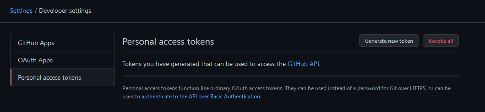
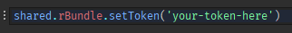

# Getting Started
Starting with rBundle is quick and easy.

## Installation
You can install rBundle from [the Roblox website](https://www.roblox.com/library/7501838573/rBundle).

## Setting Up
The first thing you need to do to actually use rBundle is get a GitHub API token. The reason for this is tokens can't be dynamically generated. Each token is also limited to **5,000 requests per hour** so if each individual is given their own token they can use their requests how they see fit.

### Create a GitHub account
If you don't already have an account head over to [GitHub](https://github.com) and create one.

### Create a personal access token
Once you have your account and are logged in you can [head here](https://github.com/settings/tokens). You should see the following screen.

Click <kbd>Generate new token</kbd>. You may have to enter your password to confirm you want to proceed. In the `Note` field of the new page you can type whatever you would like. In this example I'll just use `rBundle` to denote this token is for use with rBundle.

Set the expiration to `No expiration`. This will prevent the token from expiring so you don't ever have to worry about generating a new one.

In the `Select scopes` section all you need to do is check the `public_repo` field. This gives the token access to public repositories allowing rBundle to install them.

!!! note
    If you want rBundle to be able to install your own private bundles from your own private repositories you can check the `repo` field. This will give the token access to your private repositories.

Your finished screen should look like this:

Scroll down and press <kbd>Generate token</kbd>. You'll now see your token on screen. Copy this and make sure to write it down or keep it in a file on your computer somewhere. You won't have access to it again.

Once you your token saved you can move on to connecting it to rBundle.

## Connecting GitHub & rBundle
Head into Roblox Studio to connect both services. You might notice when you installed rBundle that there are no toolbar buttons for the plugin. The entire rBundle interface is actually kept within the Roblox Studio command line. To connect your GitHub token to rBundle you use `shared.rBundle.setToken()`. Here's an example:

Hit enter and in the output you should see `[rBundle] Successfully set GitHub token`. You won't have to worry about setting this again. rBundle has now stored this token in a `settings.json` file on your computer for future use. You're now ready to start installing packages!

## Installing a Bundle
Installing bundles is very straightforward. You'll use the `shared.rBundle.install()` function. This function either takes a string or a table of strings. The strings or string should be formatted as such: `owner/repository`. Ensure that HTTP requests are enabled in Game Settings. Let's install a test bundle to ensure everything is working fine. We'll be installing [this bundle](https://github.com/astrealRBLX/testing).

`#!lua shared.rBundle.install('astrealrblx/testing')`

rBundle will provide you with feedback as it installs the bundle.

If you check `ReplicatedStorage` you'll see a folder called `Bundles` with the bundle inside. That's it! You've successfully installed a bundle.